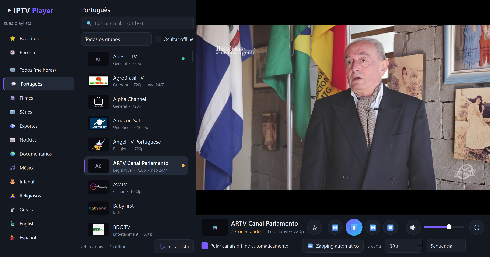
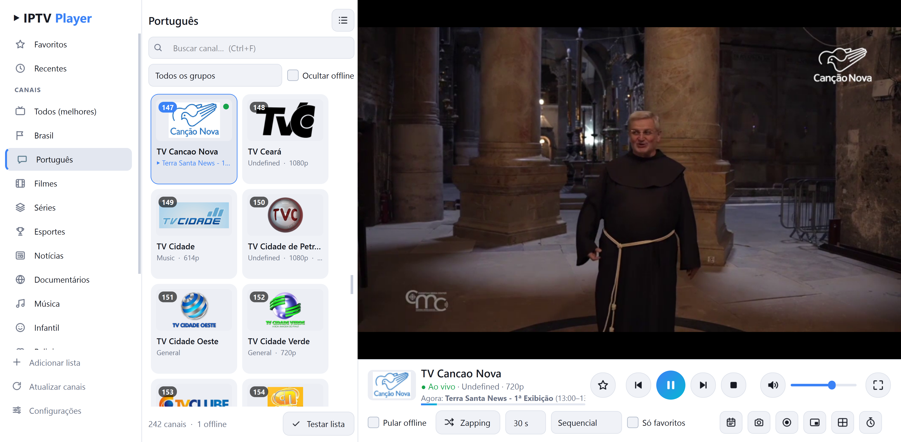

# 📺 IPTV Player

Player de IPTV para Windows com visual moderno, feito em Python (PyQt6) com o VLC embutido.
Vem com milhares de canais abertos que se atualizam sozinhos, mostra o que está passando agora
e troca de canal sozinho: pula os canais fora do ar e tem **zapping automático**.



## ⬇️ Download

Baixe na página de **[Releases](https://github.com/caionicfilho89-dot/iptv-player/releases/latest)**:

| Arquivo | Para quem |
|---|---|
| **`IPTV-Player-Setup-v….exe`** | Instalador: cria atalho na área de trabalho e no menu Iniciar. Não pede senha de administrador. |
| **`IPTV-Player-v…-Portatil.zip`** | Versão portátil: extraia e abra `IPTV Player.exe`, sem instalar nada. |

**Não precisa instalar Python nem VLC**: tudo já vem junto.

> Se o Windows mostrar *"O Windows protegeu o computador"*, clique em **Mais informações → Executar assim mesmo**.
> Isso acontece com programas novos sem assinatura digital.

## ✨ Recursos

**Canais**
- Listas por categoria (Brasil, Português, Filmes, Séries, Esportes, Notícias, Infantil…) **atualizadas
  automaticamente** a partir do [iptv-org](https://github.com/iptv-org/iptv)
- **Mundo (Free-TV)**: mais ~1.300 canais abertos do mundo todo, da lista [Free-TV](https://github.com/Free-TV/IPTV)
- **Grátis com propaganda** 🆕: Pluto TV Brasil, Pluto TV (mundo), Samsung TV Plus, Rakuten TV, Plex, Roku, Tubi,
  Xumo, Stirr, Vizio, TCL e Distro — canais oficiais de todos os países, com guia de programação; o programa testa
  sozinho e mostra só os que estão no ar
- **Estabilidade dos canais** 🆕: barrinhas de sinal mostram quais canais costumam abrir e não travar, e a lista pode
  ser ordenada pelos **mais estáveis primeiro**
- **Busca na programação** 🆕: digite "futebol" ou "jornal" e veja os canais que estão passando isso agora ou nas
  próximas horas
- **Adicione suas próprias listas** por link (ex.: a da sua operadora de IPTV) ou arquivo `.m3u`
- **Login da operadora (Xtream Codes)** 🆕: servidor, usuário e senha — canais por categoria e guia de programação
  vêm direto do servidor, e o programa mostra a validade da conta
- **Filmes e séries da operadora** 🆕: cada conta ganha *Filmes* e *Séries* na barra lateral — escolha temporada e
  episódio, **continue de onde parou** e o **próximo episódio começa sozinho**
- **Assistir o que já passou (catch-up)** 🆕: no guia, os programas marcados com ↺ podem ser vistos de novo, e o
  programa atual pode ser visto **desde o começo** (canais da operadora que guardam a programação, ou listas M3U
  com `catchup=`)
- **Guia de programação (EPG)**: o que está passando agora e a seguir, com barra de progresso
- Busca, filtro por grupo, favoritos ⭐ e recentes
- **Listas atualizadas todo dia**, com os canais que chegaram marcados como **NOVO** e reunidos na categoria **Novos**
- **Links quebrados trocados sozinhos**: se um canal cai, o app procura o mesmo canal em outro link (em qualquer lista), usa o que funcionar e lembra dele

**Troca automática**
- **Pular canais offline**: se o canal não abrir, der erro ou travar, vai para o próximo sozinho
- **Zapping automático** a cada N segundos, em ordem ou aleatório, também **só pelos favoritos**
- **Botão "1 min"**: rolagem automática que passa para o próximo canal da lista a cada minuto
- **Explorar**: passa sozinho por **todos os canais de todas as listas**, pulando os offline e os que você já viu; a lista rola acompanhando
- **Testar lista**: descobre em segundo plano quais canais estão no ar
- **Teste automático** 🆕: a cada 6 horas o programa testa todos os canais e esconde os fora do ar
- **Canais repetidos juntados** 🆕: o mesmo canal em SD/HD ou em listas diferentes aparece uma vez só (os outros
  links viram reserva automática)
- **Digite o número do canal** (como no controle remoto) para ir direto a ele

**Assistir**
- **Pausar e voltar a TV ao vivo**: o programa guarda os últimos minutos do canal enquanto você assiste —
  pause e continue de onde parou, volte ou avance 30 s, e volte para o **ao vivo** com um clique
- **Barra de tempo** 🆕 para arrastar a qualquer ponto do que foi guardado, e **salvar em vídeo o que acabou de
  passar** (último 1, 5, 10 ou 30 minutos) 🆕 — também nos canais com áudio separado
- **Dublagem por IA**: ouça a tradução em português, com o som original mais baixo por baixo (botão do
  microfone ou `Ctrl+U`) — 🆕 vozes **naturais** (Dora e Alex), além das vozes do Windows
- **Áudio e legenda do canal** 🆕: escolha outro idioma de áudio ou a legenda que o próprio canal transmite
  (botão do fone ou `Ctrl+Shift+A`); a escolha é lembrada para cada canal
- **Lembretes e gravação agendada** 🆕: no guia, escolha um programa e peça para lembrar (aviso do Windows) ou
  gravar sozinho do começo ao fim
- **Controle pelo celular** 🆕: aponte a câmera para o QR code e troque de canal, pause, volte e ajuste o volume
  pelo celular (no mesmo Wi-Fi)
- **Modo infantil** 🆕 com senha: só as categorias que você liberar aparecem
- **Tela cheia com controles flutuantes** que aparecem ao mexer o mouse
- **Janela flutuante (PiP)**: vídeo pequeno sempre visível enquanto você usa o PC
- **Mosaico**: 2, 4 ou 9 canais ao mesmo tempo
- **Gravar canal** e **tirar foto da tela**
- **Timer para desligar** (ou ao fim do programa atual)
- **Legendas traduzidas por IA**: canais em inglês, espanhol, francês e outros idiomas ganham legenda em
  português ao vivo, como a tradução automática do YouTube (botão **CC** ou `Ctrl+T`) — agora traduz a
  frase inteira, funciona com o volume baixo e usa a **placa de vídeo NVIDIA** quando houver

**Visual**
- Modo **lista** ou **grade**, tema **escuro** ou **claro** e 6 cores de destaque
- **Atualização com um clique**: quando sai uma versão nova, um clique baixa, instala e reabre o programa
- **Registro de erros** (Configurações → Abrir registro de erros), para descobrir por que algo não funcionou



## ⌨️ Atalhos

| Tecla | Ação |
|---|---|
| `0`–`9` | Ir para o canal pelo número |
| `PgUp` / `PgDn` | Canal anterior / próximo |
| `F11` ou duplo clique | Tela cheia (`Esc` para sair) |
| `↑ ↓` / `Espaço` (em tela cheia) | Trocar canal / pausar |
| `Ctrl+F` | Buscar |
| `Ctrl+D` | Favoritar canal atual |
| `Ctrl+M` | Mudo |
| `Ctrl+Z` | Liga/desliga o zapping |
| `Ctrl+Shift+Z` | Liga/desliga a rolagem automática de 1 minuto |
| `Ctrl+E` | Liga/desliga o modo Explorar |
| `Ctrl+G` | Guia de programação |
| `Ctrl+S` | Foto da tela |
| `Ctrl+R` | Gravar |
| `Ctrl+P` | Janela flutuante |
| `Ctrl+L` | Alternar lista / grade |
| `Ctrl+T` | Legendas traduzidas por IA |
| `Ctrl+U` | Dublagem por IA |
| `Ctrl+Shift+A` | Trocar o áudio do canal |
| `Ctrl+←` / `Ctrl+→` | Voltar / avançar 30 segundos |
| `Ctrl+End` | Voltar para o ao vivo |

Fotos vão para **Imagens\IPTV Player** e gravações para **Vídeos\IPTV Player**.

## 💬 Legendas traduzidas por IA

1. A IA ouve o som que está saindo do computador (por isso o som do player precisa estar ligado)
2. O **[Whisper](https://github.com/SYSTRAN/faster-whisper)** reconhece a fala **no seu próprio PC**, sem enviar o áudio para a internet
3. Só o texto reconhecido é enviado ao **Google Tradutor** para virar português

Na primeira vez que você liga, o modelo de IA é baixado (cerca de 480 MB). Em **Configurações → Legendas
traduzidas por IA** dá para escolher a qualidade (Rápido / Equilibrado / Preciso), fixar o idioma do canal,
mudar o tamanho da legenda e mostrar também a frase original.

As legendas agora mostram uma **prévia da frase** enquanto a pessoa ainda fala (com placa de vídeo), e há um
**tradutor sem internet** (NLLB-200, ~620 MB, roda no PC) — escolha em *Configurações → Tradutor*. Com o Google,
se a internet cair, o programa usa o tradutor do PC automaticamente (se ele já tiver sido baixado).

**Tem placa de vídeo NVIDIA?** Escolha a qualidade **Máxima**: ela usa o modelo *large-v3-turbo* na placa de
vídeo, que entende muito melhor idiomas menos comuns e responde em menos de 1 segundo. Na primeira vez são
baixados o modelo (~1,6 GB) e o acelerador da NVIDIA (cuBLAS/cuDNN, ~1,3 GB). Sem placa NVIDIA, o programa usa
o processador normalmente.

## 🐍 Rodando pelo código-fonte

1. Instale o **[Python 3.10+](https://www.python.org/downloads/)** (marque *"Add Python to PATH"*) e o **[VLC 64 bits](https://www.videolan.org/vlc/)**
2. Baixe este projeto (**Code → Download ZIP**) e extraia
3. Dê dois cliques em **`abrir_iptv_player.bat`** (na primeira vez ele instala as dependências)

Ou pelo terminal:

```bash
pip install -r requirements.txt
python iptv_player.py
```

Para gerar o instalador e a versão portátil: `pip install pyinstaller` e `python packaging/build.py`
(requer [Inno Setup 6](https://jrsoftware.org/isinfo.php)).

## 📜 Créditos

- Playlists do projeto [iptv-org/iptv](https://github.com/iptv-org/iptv), que reúne canais **abertos e gratuitos**
  publicamente disponíveis. Este projeto não hospeda nenhum conteúdo; os links apontam para as transmissões dos
  próprios canais, que podem sair do ar ou ser bloqueadas por região a qualquer momento.
- Guia de programação padrão do [epgshare01](https://epgshare01.online/).
- Reprodução pelo [VLC / libVLC](https://www.videolan.org/) (LGPL/GPL), incluído nas versões para download.
